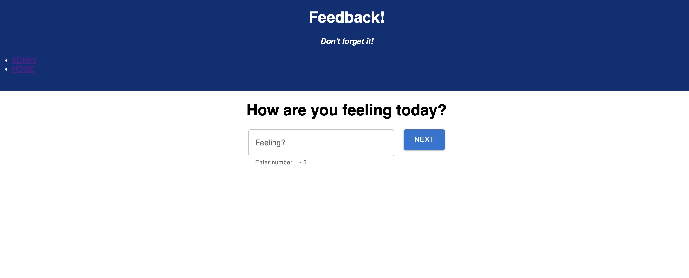
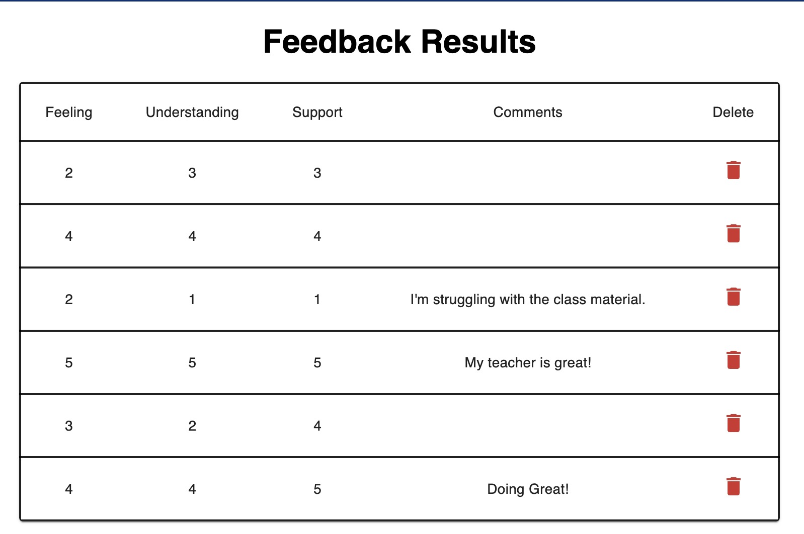

# Feedback Form

## Description

_Duration: Weekend Sprint_

This application is a single page application (SPA) feedback form that collects responses over 4 different views. There is a separate review page for each question with a submit button on the last page to save responses to the database. The user has the ability to go back to previous responses and change their answers before submitting.

There is a separate admin page where all responses are listed from the database. There is an option to delete individual responses.

## Screen Shots
HOME PAGE:

ADMIN PAGE:

### Prerequisites

- [Node.js](https://nodejs.org/en/)

## Installation

1. Create a database named `prime_feedback`
2. The queries in the `database.sql` file are set up to create all the necessary tables and populate the needed data to allow the application to run correctly. The project is built on [Postgres](https://www.postgresql.org/download/), so you will need to make sure to have that installed. Recommend using Postico to run the queries as that was used to create the queries. 
3. Open up your editor of choice and run `npm install`
4. Run `npm run server` in a terminal
5. Run `npm run client` in another terminal
6. The `npm run client` command will open up a new browser tab for you!

## Technologies
React, Redux, Node, Material-UI, Javascript, HTML/CSS, PostgreSQL
